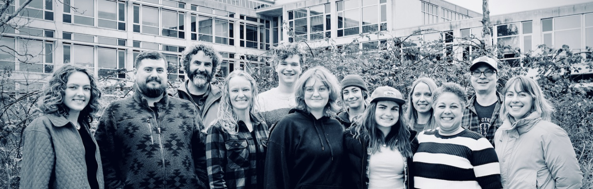

[How do marine organisms *remember* and respond to environmental change?]{.lab-lead}

We use integrative, mechanistic approaches that link molecular regulation to organismal outcomes — connecting genetics and epigenetics with physiology to reveal when responses are flexible, when they persist, and which signals best predict resilience in dynamic coastal systems. We prioritize open, reproducible science: our [code and data](https://github.com/RobertsLab), [lab notebooks](notebooks.qmd), and [presentations](publications.qmd) are shared broadly so results can be evaluated, reused, and extended. For even more, visit our [**lab handbook**](https://robertslab.github.io/resources/).

## Explore

```{=html}
<div class="nav-cards">

  <a class="nav-card" href="projects.html">
    <span class="nav-card-icon"><i class="bi bi-diagram-3"></i></span>
    <span class="nav-card-title">Projects</span>
    <span class="nav-card-desc">Active work across environmental epigenetics, reproduction, and aquaculture.</span>
  </a>

  <a class="nav-card" href="publications.html">
    <span class="nav-card-icon"><i class="bi bi-journal-text"></i></span>
    <span class="nav-card-title">Publications</span>
    <span class="nav-card-desc">Browse 100+ papers by organism and research theme.</span>
  </a>

  <a class="nav-card" href="people.html">
    <span class="nav-card-icon"><i class="bi bi-people"></i></span>
    <span class="nav-card-title">People</span>
    <span class="nav-card-desc">Meet the team, students, and lab alumni.</span>
  </a>

  <a class="nav-card" href="tools-and-apps.html">
    <span class="nav-card-icon"><i class="bi bi-grid-3x3-gap"></i></span>
    <span class="nav-card-title">Tools &amp; Apps</span>
    <span class="nav-card-desc">Interactive apps and open, reusable resources.</span>
  </a>

</div>
```

## Recent activity

::: {#recent-activity}
:::
