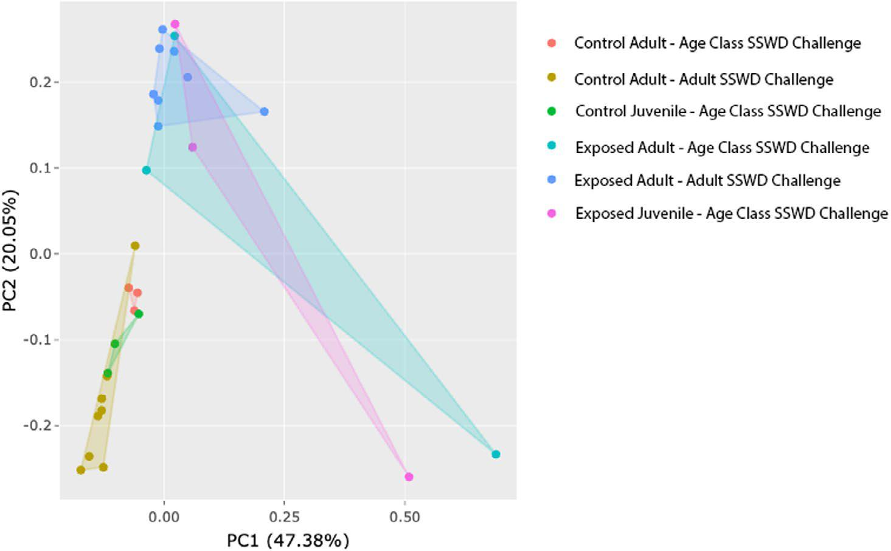

Congratulations to graduate student **Grace Crandall** and the whole team on the new paper in *Ecology and Evolution*:\

**"A Comparison of Juvenile and Adult Sunflower Sea Star Transcriptomic Responses to Challenge With Sea Star Wasting Disease Tissue Homogenates."**

**Paper:** <https://doi.org/10.1002/ece3.74379>

**Code and data:** <https://doi.org/10.5281/zenodo.14728718>

**Raw sequence data:** NCBI BioProject [PRJNA1440140](https://www.ncbi.nlm.nih.gov/bioproject/PRJNA1440140)

{width="100%"}

Since 2013, sea star wasting disease (SSWD) has swept the Northeast Pacific from Mexico to Alaska. No species has been hit harder than the sunflower sea star, *Pycnopodia helianthoides*. Billions have been lost, the species is now critically endangered, and in California, where it is functionally gone, urchins have been left free to strip kelp forests bare. Conservation breeding programs are now trying to bring *Pycnopodia* back, and one of the questions they face is whether some animals, or some life stages, are better at surviving the disease.

Field surveys hinted that they might be. Wasting adults were seen far more often than wasting juveniles, and size distributions after outbreaks shifted toward smaller animals. Grace put that idea to a controlled test. Working with collaborators at the Hakai Institute, USGS Marrowstone Marine Field Station, WDFW, and Friday Harbor Labs, the team ran two disease challenge experiments. In each, sea stars were injected with tissue homogenate from a wasting adult, which was later confirmed to contain *Vibrio pectenicida*, the recently identified causative agent. Controls received the same homogenate, heat-killed. The second experiment included both juveniles and adults. Grace then sequenced RNA from coelomocytes, the sea star immune cells, collected at the arm-drop stage of disease.

The result was clear, and a bit sobering: **juveniles were not protected**. Every exposed sea star in the age-class experiment died, adult and juvenile alike, while every control stayed healthy. Juveniles actually died faster, at 12.3 days on average versus 14.1 for adults. Gene expression told the same story. As the PCA above shows, animals grouped by whether they had been exposed, not by age. So the scarcity of wasting juveniles in the field probably has a different explanation. One possibility is that juveniles simply die before anyone sees them sick.

The other key finding is a **core transcriptional response to wasting disease**. More than 4,100 differentially expressed genes were shared across the two independent experiments, and 99.7% of them changed in the same direction in both. Those genes are enriched for immune functions, including tumor necrosis factor signaling, proteolysis, and defense response to bacteria. Age still left a smaller mark: 140 genes responded to exposure differently in juveniles and adults. Those genes are involved in development, signaling, and stress and metabolism regulation, and they may help explain why juveniles decline faster.

Now that the causative agent is known, these results give recovery efforts a baseline for what a sunflower sea star's immune response to wasting looks like, and candidate genes to track as breeding programs look for resilience. Great work, Grace!
