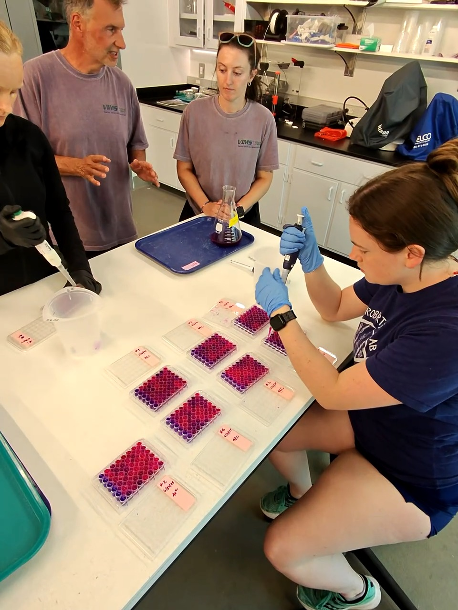

Congratulations to **Ariana Huffmyer** and the whole team on the new paper in *PeerJ*:\

**"From blue to pink: resazurin as a high-throughput proxy for metabolic rate in oysters."**

**Paper:** <https://doi.org/10.7717/peerj.21542>

**Code and data:** <https://github.com/RobertsLab/resazurin-assay-development>

**Assay development site:** <https://robertslab.github.io/resazurin-assay-development/>

{width="100%"}

Measuring metabolic rate is one of the most direct ways to ask how an animal is coping with stress, but the standard approach, respirometry, is slow enough that it rarely scales past a handful of individuals. That is a real bottleneck for aquaculture, where the interesting questions are about hundreds of animals and dozens of families. This paper shows that a redox-sensitive dye can carry much of that load. Resazurin shifts from blue to pink as it is reduced by metabolic activity, and the team adapted it from cell culture to **whole live oysters** in multi-well plates.

The validation is the heart of the study: resazurin fluorescence tracked oxygen consumption closely in both *Crassostrea gigas* and *C. virginica*, establishing the color change as a genuine metabolic proxy rather than a convenient correlate. From there the assay recovered the patterns you would hope to see. Thermal performance runs produced clear metabolic optima and tipping points where warming stopped stimulating metabolism and began suppressing it.

Two results stand out for anyone thinking about resilience. First, under acute thermal stress, the oysters that **depressed** their metabolism most were the ones more likely to survive, suggesting metabolic depression is a protective strategy rather than a symptom of failure, and that a metabolic reading can predict mortality before it happens. Second, the response is heritable enough to matter: the team detected significant family-level variation, and across **50 selectively bred *C. virginica* families** metabolic rate correlated with predicted performance.

That last point is what makes this more than a methods advance. A cheap, plate-based assay that reports on both stress tolerance and family-level genetic variation is a tool breeders and hatchery managers can actually use, whether for screening broodstock, checking seed before it goes to the field, or building resilience into stocks ahead of the next marine heatwave.

The work was first shared as a [preprint last November](../sr320-pink/), and the protocols, raw data, and analysis code are all openly available at the links above.
